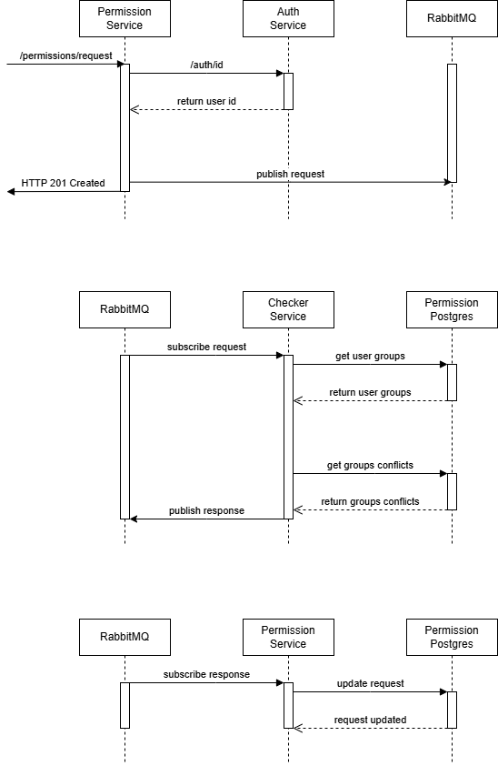
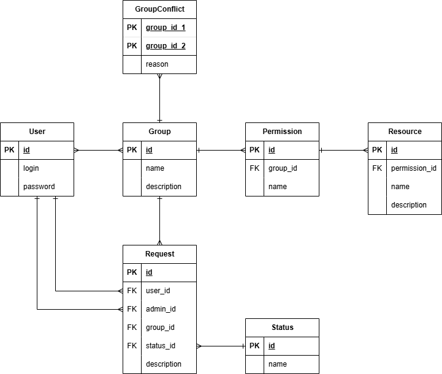

# Запуск

```shell
docker-compose --env-file ./.env.dev up --build
```

# Предметная область

Существует набор ресурсов, к которым можно выдать доступ пользователям.
Один или несколько доступов представляют собой группу доступов.
Для получения группы, пользователи должны сформировать заявку.

# Функциональные требования

Существует хотя бы 1 пользователь, который имеет группу для администрации групп других пользователей:
1) отзыв группы у пользователя

Остальные пользователи всегда имеют право:
1) получить информацию о доступе который необходим для ресурса
2) смотреть доступы у себя
3) создавать заявки для получения группы с доступами

# Sequence диаграмма сценария

Описывает процесс создания и проверки запроса на получения прав.



# ERD диаграмма

